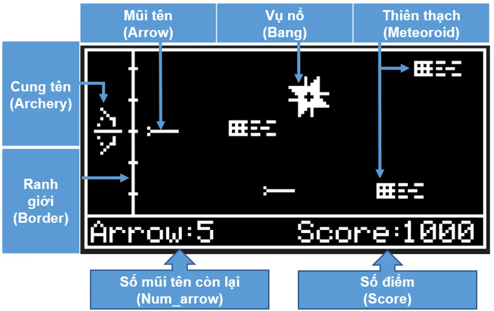
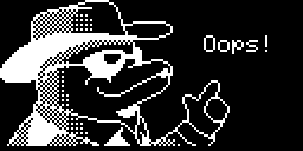

# Archery Game - Build on AK Embedded Base Kit

    <video src="https://github.com/ak-embedded-software/archery-game/assets/54855481/d493703c-bf5b-4fd2-ae04-b86784a01231" alt="epcb archery game" height=200/>

## I. Introduction

The Archery game is a game running on the AK Embedded Base Kit. It is built to help embedded programming enthusiasts learn and practice event-driven programming. During the development of the archery game, you will learn more about designing and applying UML, Tasks, Signals, Timers, Messages, State-machines,...

### 1.1 Hardware

<strong><em>Figure 1:</em></strong> AK Embedded Base Kit - STM32L151

[AK Embedded Base Kit](https://epcb.vn/products/ak-embedded-base-kit-lap-trinh-nhung-vi-dieu-khien-mcu) is an evaluation kit for advanced embedded software learners.

The KIT integrates an **OLED 1.3" LCD, 3 buttons, and a Buzzer speaker**, with these features sufficient to learn the event-driven system through practical game design.

The KIT also integrates **RS485, NRF24L01+, and Flash up to 32MB**, suitable for prototyping real-world applications in embedded systems such as wired, wireless communication, data logger storage applications,...

### 1.2 Game Description and Objects
The following description of the **“Archery game”**, explains how to play and the game's processing mechanism. This document is used for reference in designing and developing the game later.

<strong><em>Figure 2:</em></strong> Menu game

The game starts with the **Menu game** screen with the following options:
- **Archery Game:** Select to start the game.
- **Setting:** Select to set the game parameters.
- **Charts:** Select to view the top 3 highest scores.
- **Exit:** Exit the menu to the standby screen.

<strong><em>Figure 3:</em></strong> Game play screen and objects

#### 1.2.1 Objects in the Game:
|Object|Object Name|Description|
|---|---|---|
|**Bow**|Archery|Move up/down to select the position to shoot the arrow|
|**Arrow**|Arrow|Shot from the bow, used to destroy meteoroids|
|**Explosion**|Bang|Effect that appears when meteoroid is destroyed|
|**Border**|Border|Safe zone to protect from meteoroids falling into|
|**Meteoroid**|Meteoroid|Object flying towards the bow with increasing speed, capable of destroying the border|

**(*)** In the rest of the document, the names of the objects will be used to refer to the objects.

#### 1.2.2 How to Play:
- In this game, you will control the Archery, move **up/down** with the **[Up]/[Down]** buttons, to select the position to **shoot** the Arrow.
- When pressing the **[Mode]** button, the Arrow will be shot, aiming to destroy the incoming Meteoroids.
- The goal of the game is to get as many points as possible, the game will end when a Meteoroid touches the Border.

#### 1.2.3 Game Mechanics:
- **Scoring:** Points are calculated by the number of Meteoroids destroyed. Each destroyed Meteoroid corresponds to 10 points. The accumulated score will be displayed in the bottom right corner of the screen.
- **Difficulty:** Every time 200 points are accumulated, the Meteoroid's flying speed will increase by one level. The initial difficulty can be set in the **Setting** section.
- **Arrow Limit:** When shooting, the number of available Arrows will decrease corresponding to the number of flying Arrows, if the available Arrows decrease to "0", you cannot shoot and there will be a warning sound. The number of available Arrows will be restored when a Meteoroid is destroyed or the Arrow flies off the screen. The number of Arrows is displayed in the bottom left corner of the screen and can be changed in the **Setting**.

- **Animation:** To make the game more lively, objects will have additional animation when moving.
- **Game Over:** When a Meteoroid touches the Border, the game will end. Objects will be reset and the score will be saved. You will enter the “Game Over” screen with 3 options:
  - **Restart:** play again.
  - **Charts:** go to view the leaderboard.
  - **Home:** back to the game menu.

<strong><em>Figure 5:</em></strong> Game_over screen

<strong><em>Figure 6:</em></strong> Game_over dolphin screen

## II. Documentation

| File | Description |
|---|---|
| [README.md](README.md) | Main project overview, hardware information, gameplay rules, and object descriptions. |
| [docs/Archery_Game_Signal_Processing.md](docs/Archery_Game_Signal_Processing.md) | Detailed signal-processing document for button input, AK task messages, timers, game-loop ticks, object updates, and Mermaid sequence diagrams. |
| [docs/Data_setting_eeprom.md](docs/Data_setting_eeprom.md) | EEPROM data document describing game setting and score storage, Magic number validation, checksum protection, read/write flow, and related APIs. |
| [docs/Object_Sequence.md](docs/Object_Sequence.md) | Sequence document for each gameplay object: Archery, Arrow, Meteoroid, Bang, and Border. |
| [docs/design_game_display.md](docs/design_game_display.md) | TODO document for display layout, screen design, bitmap assets, rendering flow, and screen transitions. |
| [docs/buzzer_music.md](docs/buzzer_music.md) | TODO document for buzzer sound list, music behavior, silent mode, and playback rules. |

## Contact & Support

LinkedIn: [www.linkedin.com/in/quocbuu](https://www.linkedin.com/in/quocbuu)

Mail: [pquocbuu@gmail.com](mailto:pquocbuu@gmail.com)

Phone: 0931993857
