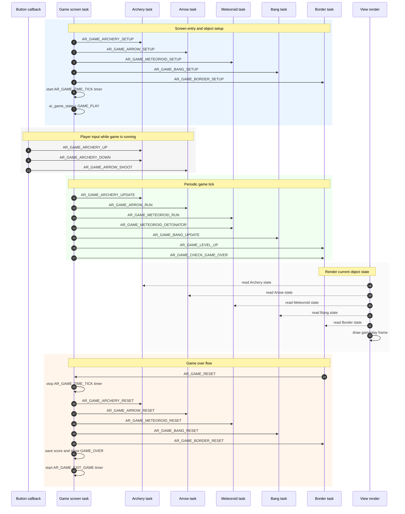
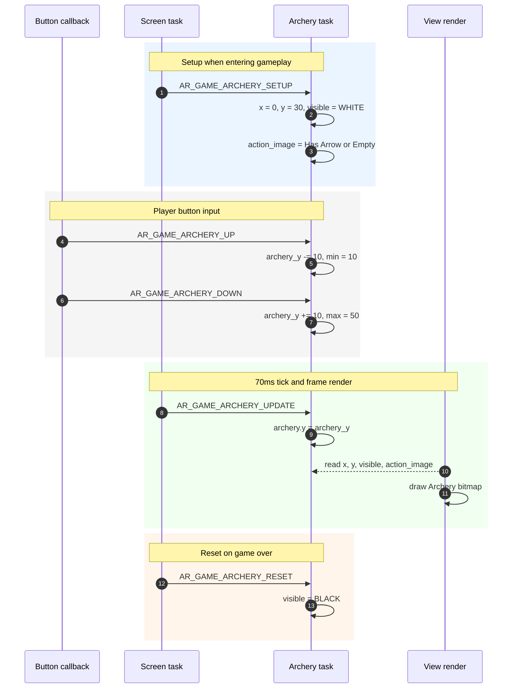
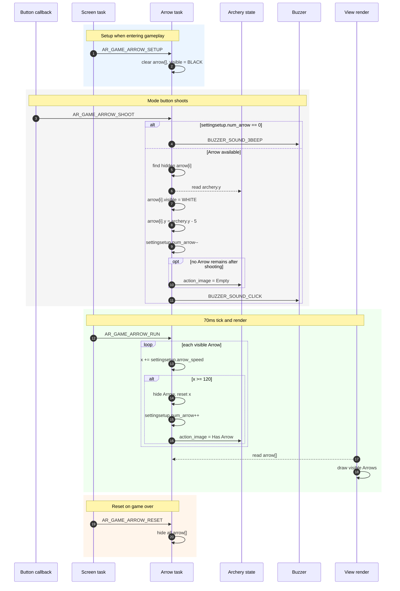
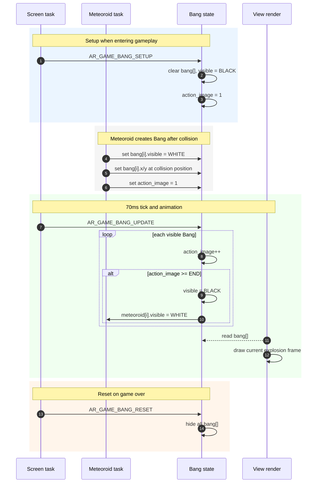
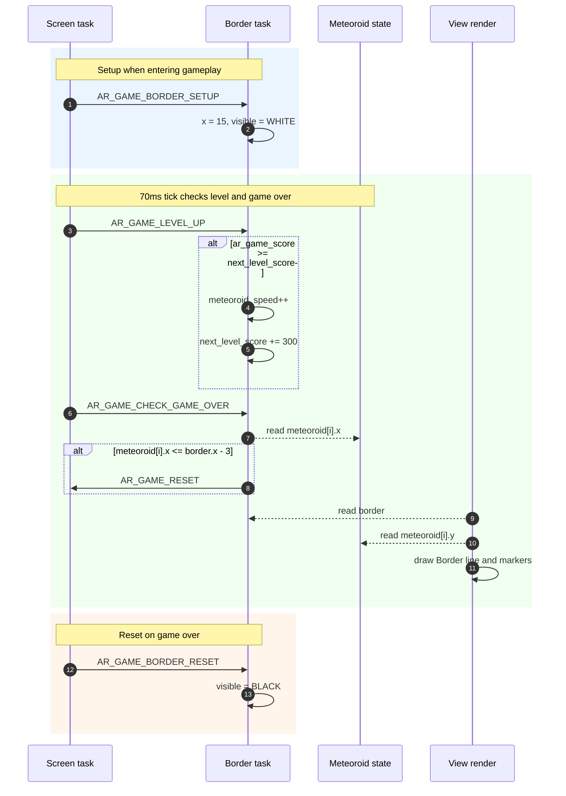
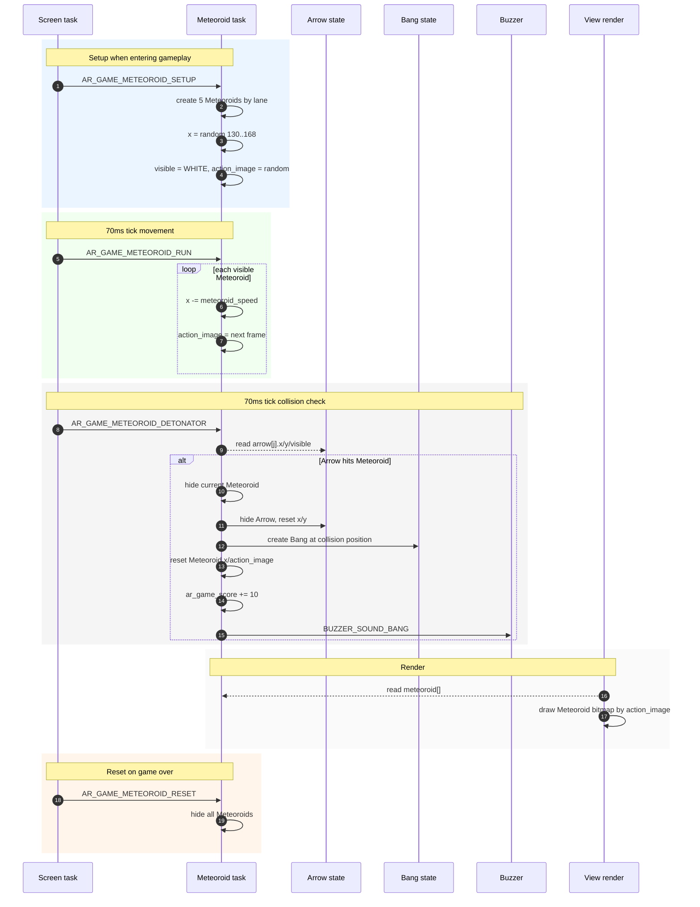
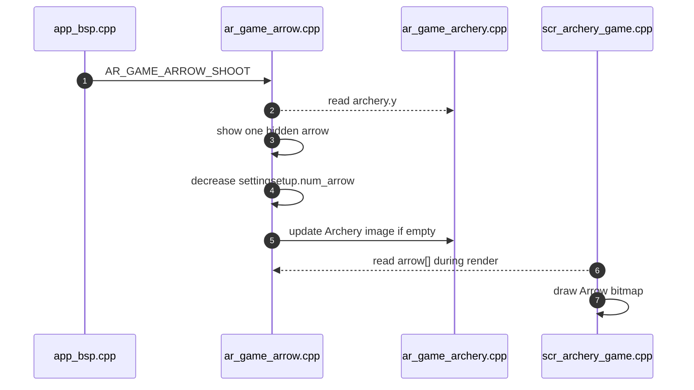

# Archery Game - Build on AK Embedded Base Kit

| [VN] | [EN](README_en.md) |

## I. Giới thiệu

Archery game là một tựa game chạy trên AK Embedded Base Kit. Được xây dựng nhằm mục đích giúp các bạn có đam mê về lập trình nhúng có thể tìm hiểu và thực hành về lập trình event-driven. Trong quá trình xây dựng nên archery game, các bạn sẽ hiểu thêm về cách thiết kế và ứng dụng UML, Task, Signal, Timer, Message, State-machine,... 

### 1.1 Phần cứng

<p align="center"></p>
<p align="center"><strong><em>Hình 1:</em></strong> AK Embedded Base Kit - STM32L151</p>

[AK Embedded Base Kit](https://epcb.vn/products/ak-embedded-base-kit-lap-trinh-nhung-vi-dieu-khien-mcu) là một evaluation kit dành cho các bạn học phần mềm nhúng nâng cao.

KIT tích hợp LCD **OLED 1.3", 3 nút nhấn, và 1 loa Buzzer phát nhạc**, với các trang bị này thì đã đủ để học hệ thống event-driven thông qua thực hành thiết kế máy chơi game.

KIT cũng tích hợp **RS485**, **NRF24L01+**, và **Flash** lên đến 32MB, thích hợp cho prototype các ứng dụng thực tế trong hệ thống nhúng hay sử dụng như: truyền thông có dây, không dây wireless, các ứng dụng lưu trữ data logger,...

### 1.2 Mô tả trò chơi và đối tượng
Phần mô tả sau đây về **“Archery game”** , giải thích cách chơi và cơ chế xử lý của trò chơi. Tài liệu này dùng để tham khảo thiết kế và phát triển trò chơi về sau.

<p align="center"></p>
<p align="center"><strong><em>Hình 2:</em></strong> Menu game</p>

Trò chơi bắt đầu bằng màn hình **Menu game** với các lựa chọn sau: 
- **Archery Game:** Chọn vào để bắt đầu chơi game.
- **Setting:** Chọn vào để cài đặt các thông số của game.
- **Charts:** Chọn vào để xem top 3 điểm cao nhất đạt được.
- **Exit:** Thoát menu vào màn hình chờ.

<p align="center"></p>
<p align="center"><strong><em>Hình 3:</em></strong> Màn hình game play và các đối tượng</p>

#### 1.2.1 Các đối tượng (Object) trong game:
|Đối tượng|Tên đối tượng|Mô tả|
|---|---|---|
|**Cung tên**|Archery|Di chuyển lên/xuống để chọn vị trí bắn ra mũi tên|
|**Mũi tên**|Arrow|Bắn ra từ cung tên, dùng để phá hủy thiên thạch|
|**Vụ nổ**|Bang|Hiệu ứng xuất hiện khi thiên thạch bị phá hủy|
|**Ranh giới**|Border|Vùng an toàn phải bảo vệ không cho thiên thạch rơi vào|
|**Thiên thạch**|Meteoroid|Vật thể bay về phía cung tên với tốc độ tăng dần, có khả năng phá hủy ranh giới|

**(*)** Trong phần còn lại của tài liệu sẽ dùng tên của các đối tượng để đề cập đến đối tượng.

#### 1.2.2 Cách chơi game: 
- Trong trò chơi này bạn sẽ điều khiển Archery, di chuyển **lên/xuống** bằng hai nút **[Up]/[Down]**, để chọn vị trí **bắn ra** Arrow.
- Khi nhấn nút **[Mode]** Arrow sẽ được bắn ra, nhằm phá hủy các Meteoroid đang bay đến.
- Mục tiêu trò chơi là kiếm được càng nhiều điểm càng tốt, trò chơi sẽ kết thúc khi có Meteoroid chạm vào Border.

#### 1.2.3 Cơ chế hoạt động:
- **Cách tính điểm:** Điểm được tính bằng số lượng Meteoroid bị phá hủy. Mỗi Meteoroid bị phá hủy tương ứng với 10 điểm. Số điểm tích lũy được sẽ hiển thị ở góc dưới bên phải màn hình.
- **Độ khó:** Mỗi khi tích lũy được 200 điểm, tốc độ bay của Meteoroid sẽ tăng lên một cấp độ. Độ khó ban đầu có thể cài đặt trong phần **Setting**.
- **Giới hạn của Arrow:** Khi bắn thì số lượng Arrow hiện có sẽ giảm đi tương ứng số lượng Arrow đang bay, nếu Arrow hiện có giảm về "0" thì không thể bắn được và sẽ có âm thanh báo. Số lượng Arrow hiện có sẽ được hồi lại khi phá hủy được Meteoroid hoặc Arrow bay hết màn hình game. Số lượng Arrow được hiển thị ở góc dưới bên trái màn hình và có thể thay đổi trong phần **Setting**.

- **Animation:** Để trò chơi thêm phần sinh động thì các đối tượng sẽ có thêm hoạt ảnh lúc di chuyển.
- **Kết thúc trò chơi:** Khi Meteoroid chạm vào Border, trò chơi sẽ kết thúc. Các đối tượng sẽ được reset và số điểm sẽ được lưu. Bạn sẽ vào màn hình “Game Over” với 3 lựa chọn là:
  - **Restart:** chơi lại.
  - **Charts:** vào xem bảng xếp hạng.
  - **Home:** về lại menu game.

<p align="center"></p>
<p align="center"><strong><em>Hình 4:</em></strong> Màn hình Game_over</p>

## II. Thiết kế - ARCHERY GAME

Archery Game được thiết kế theo mô hình **event-driven** của AK framework:

- **Task** là đơn vị nhận và xử lý message.
- **Signal** là loại sự kiện/công việc cần xử lý.
- **Message** là gói dữ liệu được đưa vào hàng đợi task; trong game này phần lớn message là pure message, chỉ chứa signal.
- **Handler** là hàm xử lý message của từng task, ví dụ `ar_game_arrow_handle()` hoặc `scr_archery_game_handle()`.

### 2.1 Sơ đồ trình tự

Sơ đồ dưới đây mô tả luồng tổng quát của màn hình chơi game, đối chiếu theo `scr_archery_game.cpp`, `app_bsp.cpp` và các object trong `application/sources/app/game/archery_game`.



Các mốc chính:
- `SCREEN_ENTRY`: đọc setting từ EEPROM, setup toàn bộ object, tạo timer `AR_GAME_TIME_TICK`.
- `AR_GAME_TIME_TICK`: tick game hiện tại là `70ms`, dùng để cập nhật object và kiểm tra game over.
- Button callback trong `app_bsp.cpp` gửi trực tiếp signal game khi `ar_game_state != GAME_OFF`.
- Khi Border phát hiện Meteoroid chạm ranh giới, Border gửi `AR_GAME_RESET` về `AR_GAME_SCREEN_ID`.
- Sau reset, Screen lưu điểm, hiển thị trạng thái `GAME_OVER`, rồi chuyển sang màn hình Game Over bằng timer `AR_GAME_EXIT_GAME`.

### 2.2 Chi tiết

Các thành phần quan trọng của game gồm object state, task xử lý, signal trao đổi giữa các task và dữ liệu setting/score lưu EEPROM.

#### 2.2.1 Thuộc tính đối tượng

Các object trong game đều dùng một nhóm thuộc tính chung để render và cập nhật animation:

|Thuộc tính|Ý nghĩa|
|---|---|
|`visible`|Quy định object có được vẽ lên màn hình hay không.|
|`x`, `y`|Tọa độ hiện tại của object trên màn hình OLED 128x64.|
|`action_image`|Frame hình ảnh hiện tại, dùng cho animation hoặc trạng thái hiển thị.|

Áp dụng trong source hiện tại:

|Object|Struct|Biến chính|Số lượng|Ghi chú|
|---|---|---|---|---|
|Archery|`ar_game_archery_t`|`archery`|1|Có 2 frame: has-arrow và empty.|
|Arrow|`ar_game_arrow_t`|`arrow[MAX_NUM_ARROW]`|Tối đa 9|Số lượng tối đa lấy từ `AR_GAME_SETTING_NUM_ARROW_MAX`.|
|Bang|`ar_game_bang_t`|`bang[NUM_BANG]`|5|Hiệu ứng nổ 3 frame.|
|Border|`ar_game_border_t`|`border`|1|Ranh giới tại `x = 15`.|
|Meteoroid|`ar_game_meteoroid_t`|`meteoroid[NUM_METEOROIDS]`|5|Mỗi Meteoroid nằm trên một lane.|

Các biến trạng thái và cấu hình quan trọng:

|Biến|Kiểu|Vai trò|
|---|---|---|
|`ar_game_state`|`uint8_t`|Trạng thái game: `GAME_OFF`, `GAME_PLAY`, `GAME_OVER`.|
|`ar_game_score`|`uint32_t`|Điểm hiện tại trong lượt chơi.|
|`settingsetup`|`ar_game_setting_t`|Setting đang dùng trong lượt chơi.|
|`gamescore`|`ar_game_score_t`|Bảng điểm đọc/ghi EEPROM.|

`ar_game_setting_t` gồm `silent`, `num_arrow`, `arrow_speed`, `meteoroid_speed`. `ar_game_score_t` lưu `score_now`, `score_1st`, `score_2nd`, `score_3rd`.

#### 2.2.2 Task

Các task của Archery Game được đăng ký trong `application/sources/app/task_list.cpp`, cùng mức ưu tiên `TASK_PRI_LEVEL_4`.

|Task ID|Handler|Vai trò|
|---|---|---|
|`AR_GAME_SCREEN_ID`|`scr_archery_game_handle`|Điều phối vòng đời game: setup, tick, reset, game over, chuyển màn hình.|
|`AR_GAME_ARCHERY_ID`|`ar_game_archery_handle`|Quản lý vị trí và trạng thái hình ảnh của Archery.|
|`AR_GAME_ARROW_ID`|`ar_game_arrow_handle`|Bắn Arrow, cập nhật vị trí Arrow, hồi số Arrow khi ra khỏi màn hình.|
|`AR_GAME_METEOROID_ID`|`ar_game_meteoroid_handle`|Tạo Meteoroid, di chuyển, animation, kiểm tra collision với Arrow.|
|`AR_GAME_BANG_ID`|`ar_game_bang_handle`|Cập nhật animation vụ nổ và bật lại Meteoroid sau khi nổ xong.|
|`AR_GAME_BORDER_ID`|`ar_game_border_handle`|Tăng level theo điểm và kiểm tra điều kiện game over.|

Ngoài nhóm task game, `AC_TASK_DISPLAY_ID` vẫn là task quản lý screen chung. Khi ở ngoài gameplay, button callback sẽ gửi signal về `AC_TASK_DISPLAY_ID`; khi đang gameplay, callback gửi trực tiếp đến `AR_GAME_ARCHERY_ID` hoặc `AR_GAME_ARROW_ID`.

#### 2.2.3 Message & Signal

Các signal chính được định nghĩa trong `application/sources/app/app.h`.

|Nhóm|Signal|Ý nghĩa|
|---|---|---|
|Screen|`AR_GAME_TIME_TICK`|Timer tick định kỳ để cập nhật toàn bộ object.|
|Screen|`AR_GAME_RESET`|Reset game khi Border phát hiện thua.|
|Screen|`AR_GAME_OVER_TEXT_ANIM_TICK`|Timer chạy hiệu ứng text ở trạng thái game over.|
|Screen|`AR_GAME_EXIT_GAME`|Timer one-shot để chuyển sang màn hình Game Over.|
|Archery|`AR_GAME_ARCHERY_SETUP`|Khởi tạo vị trí và trạng thái Archery.|
|Archery|`AR_GAME_ARCHERY_UPDATE`|Copy vị trí điều khiển nội bộ sang vị trí render.|
|Archery|`AR_GAME_ARCHERY_UP`|Di chuyển Archery lên.|
|Archery|`AR_GAME_ARCHERY_DOWN`|Di chuyển Archery xuống.|
|Archery|`AR_GAME_ARCHERY_RESET`|Ẩn Archery khi thoát gameplay.|
|Arrow|`AR_GAME_ARROW_SETUP`|Clear toàn bộ Arrow.|
|Arrow|`AR_GAME_ARROW_RUN`|Cập nhật vị trí Arrow đang bay.|
|Arrow|`AR_GAME_ARROW_SHOOT`|Bắn Arrow từ vị trí hiện tại của Archery.|
|Arrow|`AR_GAME_ARROW_RESET`|Ẩn toàn bộ Arrow.|
|Meteoroid|`AR_GAME_METEOROID_SETUP`|Tạo Meteoroid ban đầu theo lane.|
|Meteoroid|`AR_GAME_METEOROID_RUN`|Di chuyển Meteoroid và đổi frame animation.|
|Meteoroid|`AR_GAME_METEOROID_DETONATOR`|Kiểm tra va chạm Arrow-Meteoroid.|
|Meteoroid|`AR_GAME_METEOROID_RESET`|Ẩn toàn bộ Meteoroid.|
|Bang|`AR_GAME_BANG_SETUP`|Clear toàn bộ Bang.|
|Bang|`AR_GAME_BANG_UPDATE`|Cập nhật frame nổ.|
|Bang|`AR_GAME_BANG_RESET`|Ẩn toàn bộ Bang.|
|Border|`AR_GAME_BORDER_SETUP`|Khởi tạo Border.|
|Border|`AR_GAME_LEVEL_UP`|Tăng tốc Meteoroid khi điểm đạt mốc.|
|Border|`AR_GAME_CHECK_GAME_OVER`|Kiểm tra Meteoroid chạm Border.|
|Border|`AR_GAME_BORDER_RESET`|Ẩn Border.|

## III. Hướng dẫn chi tiết code trong đối tượng

Các object trong game được tổ chức theo hướng event-driven. `scr_archery_game.cpp` là nơi phát các signal chính khi vào game, mỗi tick 70ms, và khi reset game. Các file trong `application/sources/app/game/archery_game` chỉ tập trung xử lý trạng thái riêng của từng object.

### 3.1 Archery

Archery là object người chơi điều khiển bằng nút **[Up]** và **[Down]**. Source chính: `ar_game_archery.cpp`.



Tóm tắt:
- `archery_y` là vị trí điều khiển nội bộ; mỗi tick mới copy sang `archery.y` để render.
- Archery có 2 trạng thái hình ảnh: còn Arrow và hết Arrow.
- Button không vẽ trực tiếp; button chỉ gửi signal cho task Archery.

### 3.2 Arrow

Arrow quản lý danh sách mũi tên đang bay. Source chính: `ar_game_arrow.cpp`.



Tóm tắt:
- Arrow chỉ bắn khi còn `settingsetup.num_arrow`.
- Mỗi Arrow bay theo trục X, tốc độ lấy từ setting.
- Khi Arrow bay hết màn hình hoặc phá hủy Meteoroid, số Arrow khả dụng được hồi lại.

### 3.3 Bang

Bang là hiệu ứng nổ sau khi Arrow phá hủy Meteoroid. Source chính: `ar_game_bang.cpp`; Bang được kích hoạt từ `ar_game_meteoroid.cpp` khi có va chạm.



Tóm tắt:
- Bang không tự kiểm tra va chạm; Meteoroid tạo Bang khi phát hiện collision.
- Animation có 3 frame, sau frame cuối Bang tự ẩn.
- Khi Bang kết thúc, Meteoroid tương ứng được bật lại để tiếp tục vòng chơi.

### 3.4 Border

Border là ranh giới an toàn bên trái màn hình. Source chính: `ar_game_border.cpp`.



Tóm tắt:
- Border không di chuyển, chỉ dùng để kiểm tra thua game.
- Mỗi 300 điểm, tốc độ Meteoroid tăng thêm nếu chưa chạm giới hạn setting.
- Khi Meteoroid vượt tới `border.x - 3`, Border gửi `AR_GAME_RESET` về Screen.

### 3.5 Meteoroid

Meteoroid là nhóm thiên thạch bay từ phải sang trái. Source chính: `ar_game_meteoroid.cpp`.



Tóm tắt:
- Có 5 Meteoroid, mỗi con nằm trên một lane cách nhau 10px theo trục Y.
- Vị trí X ban đầu và sau khi bị bắn được random từ ngoài mép phải màn hình.
- Meteoroid vừa xử lý chuyển động, vừa kiểm tra collision với Arrow.

## IV. Hiển thị và âm thanh trong trò chơi bắn cung

### 4.1 Đồ họa

Trò chơi hiển thị trên màn hình **OLED 1.3" 128x64 px**, vì vậy toàn bộ đối tượng trong game được thiết kế bằng bitmap đen trắng có kích thước nhỏ và cố định. Các bitmap đang được khai báo trong `application/sources/app/screens/screens_bitmap.cpp` và expose qua `screens_bitmap.h`.

#### 4.1.1 Thiết kế đồ họa cho các đối tượng

<p align="center"></p>
<p align="center"><strong><em>Hình 13:</em></strong> Bitmap của các đối tượng</p>

Các bitmap chính của màn hình chơi game:

|Đối tượng|Bitmap|Kích thước|Ghi chú|
|---|---|---|---|
|Archery|`bitmap_archery_I`, `bitmap_archery_II`|15x15 px|Đổi theo `archery.action_image`, tương ứng trạng thái còn tên / hết tên.|
|Arrow|`bitmap_arrow`|10x5 px|Hiển thị cho từng phần tử `arrow[i]` đang `visible`.|
|Meteoroid|`bitmap_meteoroid_I`, `bitmap_meteoroid_II`, `bitmap_meteoroid_III`|20x10 px|Tạo animation bằng cách tăng `meteoroid[i].action_image` theo mỗi tick.|
|Bang|`bitmap_bang_I`, `bitmap_bang_II`, `bitmap_bang_III`|15x15 px, 10x10 px|Hiệu ứng vụ nổ sau khi Arrow chạm Meteoroid.|
|Border|-|Đường dọc 0..54 px|Vẽ bằng `drawFastVLine()` và các chấm theo vị trí Meteoroid.|
|Game over|`bitmap_dolphin`|119x62 px|Hiển thị nền game-over kèm text động như `Excellent`, `Too Bad!`, ...|

Mỗi object có các thuộc tính chung như `visible`, `x`, `y`, `action_image`. Khi `visible == WHITE`, hàm display tương ứng sẽ vẽ object bằng `view_render.drawBitmap()` hoặc primitive của màn hình.

#### 4.1.2 Luồng hiển thị

Màn hình chơi game được render bởi `view_scr_archery_game()` trong `scr_archery_game.cpp`. Khi game đang chạy (`GAME_PLAY`), màn hình được ghép từ các lớp:

- `ar_game_frame_display()`: vẽ khung, số Arrow còn lại và Score.
- `ar_game_archery_display()`: vẽ cung tên.
- `ar_game_arrow_display()`: vẽ các mũi tên đang bay.
- `ar_game_meteoroid_display()`: vẽ các thiên thạch.
- `ar_game_bang_display()`: vẽ hiệu ứng nổ.
- `ar_game_border_display()`: vẽ ranh giới an toàn.

Khi game chuyển sang `GAME_OVER`, màn hình xóa nội dung cũ, vẽ `bitmap_dolphin`, rồi in dần chuỗi kết quả bằng timer `AR_GAME_OVER_TEXT_ANIM_TICK`.

```cpp
if (ar_game_state == GAME_PLAY) {
    ar_game_frame_display();
    ar_game_archery_display();
    ar_game_arrow_display();
    ar_game_meteoroid_display();
    ar_game_bang_display();
    ar_game_border_display();
}
```

### 4.2 Âm thanh

Âm thanh hiện tại được quản lý qua driver buzzer. Ở tầng application, code không gọi trực tiếp từng mảng tone dài nữa mà gọi theo sound ID:

```cpp
BUZZER_PlaySound(BUZZER_SOUND_CLICK);
BUZZER_Sleep(settingdata.silent);
```

Các sound ID được định nghĩa trong `application/sources/driver/buzzer/buzzer_music.h`, ánh xạ sang mảng tone trong `application/sources/driver/buzzer/buzzer.c`, còn dữ liệu tone nằm trong `buzzer_music.c`. Cách này giúp phần screen/game chỉ quan tâm đến sự kiện cần phát âm thanh.

Các âm thanh đang dùng trong màn hình và game:

|Sự kiện|Sound ID|Nơi gọi chính|
|---|---|---|
|Bấm nút, di chuyển menu, chọn item|`BUZZER_SOUND_CLICK`|`scr_menu_game.cpp`, `scr_game_setting.cpp`, `scr_game_over.cpp`, `scr_charts_game.cpp`|
|Bắn Arrow thành công|`BUZZER_SOUND_CLICK`|`ar_game_arrow.cpp`|
|Không còn Arrow để bắn|`BUZZER_SOUND_3BEEP`|`ar_game_arrow.cpp`|
|Arrow phá hủy Meteoroid|`BUZZER_SOUND_BANG`|`ar_game_meteoroid.cpp`|
|Startup|`BUZZER_SOUND_STARTUP`|`scr_startup.cpp`, `scr_game_setting.cpp`|
|Game over điểm cao|`BUZZER_SOUND_HIGHSCORE`|`scr_archery_game.cpp`|
|Game over điểm thấp|`BUZZER_SOUND_LOWSCORE`|`scr_archery_game.cpp`|
|Bật/tắt âm thanh theo setting|`BUZZER_Sleep(settingdata.silent)`|`scr_startup.cpp`, `scr_game_setting.cpp`|

## V. Quản lý EEPROM

EEPROM được sử dụng để lưu lại các dữ liệu cần giữ sau khi tắt nguồn, bao gồm bảng điểm và cấu hình trò chơi. Vì EEPROM có thể chứa dữ liệu rác, nên mỗi khối dữ liệu lưu xuống EEPROM sẽ được bọc thêm `Magic number` và `checksum` để đảm bảo tính toàn vẹn.

### 5.1 Cấu trúc quản lý

Mỗi record lưu vào EEPROM có dạng:

```text
+----------------------+----------------------+----------------------+
| Magic number         | Data                 | Checksum             |
| 4 bytes              |                      | 1 byte               |
+----------------------+----------------------+----------------------+
```

Trong đó:
- `Magic number`: Với mỗi ứng dụng có 1 Magic number riêng.
- `Data`: Dữ liệu cần lưu.
- `Checksum`: Tổng các byte từ `Magic number` đến hết phần `data`, dùng để kiểm tra dữ liệu có bị thay đổi hay không.

### 5.2 Tác dụng

Cơ chế sử dụng `Magic number` kết hợp với `Checksum` giúp đảm bảo tính hợp lệ và toàn vẹn của dữ liệu trong EEPROM:
- **Phát hiện dữ liệu bị lỗi hoặc bị thay đổi ngoài ý muốn:** `Checksum` cho phép kiểm tra tính toàn vẹn của dữ liệu, tránh sử dụng dữ liệu đã bị hỏng.
- **Phát hiện dữ liệu phù hợp:** với mỗi ứng dụng nên dùng 1 `Magic number` riêng, việc này giúp tránh đọc nhầm dữ liệu của firmware khác.

**Code:**
```cpp
extern bool ar_game_score_read(ar_game_score_t* data);
extern bool ar_game_score_write(ar_game_score_t* data);

extern bool ar_game_setting_read(ar_game_setting_t* data);
extern bool ar_game_setting_write(ar_game_setting_t* data);
```

## VI. Hướng dẫn đọc source và mở rộng game

Phần này dành cho intern mới vào source. Khi đọc code, nên đi theo luồng **screen -> signal -> task handler -> object state -> render** thay vì đọc từng file rời rạc.

### 6.1 Bản đồ source

|Khu vực|File/thư mục|Nên đọc khi cần|
|---|---|---|
|Khởi tạo app|`application/sources/app/app.cpp`|Xem app tạo task, timer, button, display và entry screen như thế nào.|
|Danh sách task|`application/sources/app/task_list.cpp`|Biết task ID nào gọi handler nào.|
|Signal/timer|`application/sources/app/app.h`|Tra tên signal, timer interval và nhóm signal theo task.|
|Button input|`application/sources/app/app_bsp.cpp`|Xem nút Mode/Up/Down gửi signal nào khi gameplay hoặc menu.|
|Screen manager|`application/sources/common/screen_manager.cpp`|Hiểu `SCREEN_CTOR`, `SCREEN_TRAN`, `SCREEN_ENTRY`, render interval.|
|Render OLED|`application/sources/common/view_render.cpp`|Hiểu view được clear, render từng item và update ra màn hình.|
|Gameplay screen|`application/sources/app/screens/scr_archery_game.cpp`|Luồng setup game, tick, reset, save score, game-over text.|
|Object logic|`application/sources/app/game/archery_game/*.cpp`|Logic riêng của Archery, Arrow, Bang, Border, Meteoroid.|
|Bitmap/icon|`application/sources/app/screens/screens_bitmap.cpp`|Dữ liệu bitmap dùng để vẽ object và icon.|
|EEPROM|`application/sources/app/app_eeprom.cpp`|Đọc/ghi setting và score với magic number + checksum.|
|Buzzer|`application/sources/driver/buzzer`|Danh sách sound ID, tone data, hàm `BUZZER_PlaySound()`.|

### 6.2 Cách trace một signal

Ví dụ trace nút **[Mode]** để bắn Arrow:



Các bước trace chung:

1. Tìm signal trong `app.h`.
2. Tìm nơi gửi signal bằng `rg "SIGNAL_NAME" application/sources/app`.
3. Tìm task nhận signal trong `task_list.cpp`.
4. Đọc `case SIGNAL_NAME` trong handler tương ứng.
5. Kiểm tra biến state mà handler thay đổi.
6. Tìm hàm display đọc biến đó trong `scr_archery_game.cpp`.

### 6.3 Quy trình sửa hoặc thêm object

Khi thêm một object gameplay mới, làm theo checklist này:

|Bước|Việc cần làm|File thường chạm|
|---|---|---|
|1|Định nghĩa struct, số lượng, kích thước bitmap, enum `action_image`.|`game/archery_game/ar_game_xxx.h`|
|2|Viết handler xử lý `SETUP`, `UPDATE/RUN`, `RESET`.|`game/archery_game/ar_game_xxx.cpp`|
|3|Thêm task ID và signal.|`task_list.h`, `app.h`|
|4|Đăng ký task vào bảng task.|`task_list.cpp`|
|5|Gửi signal setup/tick/reset từ screen.|`screens/scr_archery_game.cpp`|
|6|Thêm hàm display và gọi trong `view_scr_archery_game()`.|`screens/scr_archery_game.cpp`|
|7|Thêm bitmap nếu object cần hình mới.|`screens/screens_bitmap.cpp`, `screens_bitmap.h`|
|8|Kiểm tra collision hoặc tương tác với object khác nếu có.|`ar_game_meteoroid.cpp`, `ar_game_arrow.cpp`, hoặc handler liên quan.|

### 6.4 Quy trình sửa setting, score và sound

- Muốn thêm setting mới: thêm field vào `ar_game_setting_t`, cập nhật default trong `app_eeprom.cpp`, cập nhật màn hình `scr_game_setting.cpp`, rồi kiểm tra checksum EEPROM.
- Muốn đổi luật tính điểm: bắt đầu từ `ar_game_meteoroid.cpp` nơi `ar_game_score += 10`, sau đó kiểm tra `ar_game_border.cpp` vì level phụ thuộc điểm.
- Muốn đổi bảng xếp hạng: đọc `rank_ranking()` trong `scr_archery_game.cpp` và màn hình `scr_charts_game.cpp`.
- Muốn thêm âm thanh: thêm sound ID trong `buzzer_music.h`, thêm tone data trong `buzzer_music.c`, map sound sang tone trong `buzzer.c`, rồi gọi `BUZZER_PlaySound()`.

### 6.5 Checklist trước khi gửi bài

- Build không lỗi.
- Gameplay vẫn vào được từ menu.
- Nút **Up/Down/Mode** vẫn đúng chức năng trong gameplay và menu.
- Game over vẫn lưu score và chuyển sang màn hình Game Over.
- Setting đọc/ghi EEPROM không làm mất default khi EEPROM chưa có dữ liệu hợp lệ.
- Mermaid trong README vẫn render được trên GitHub hoặc VS Code có Mermaid preview.
