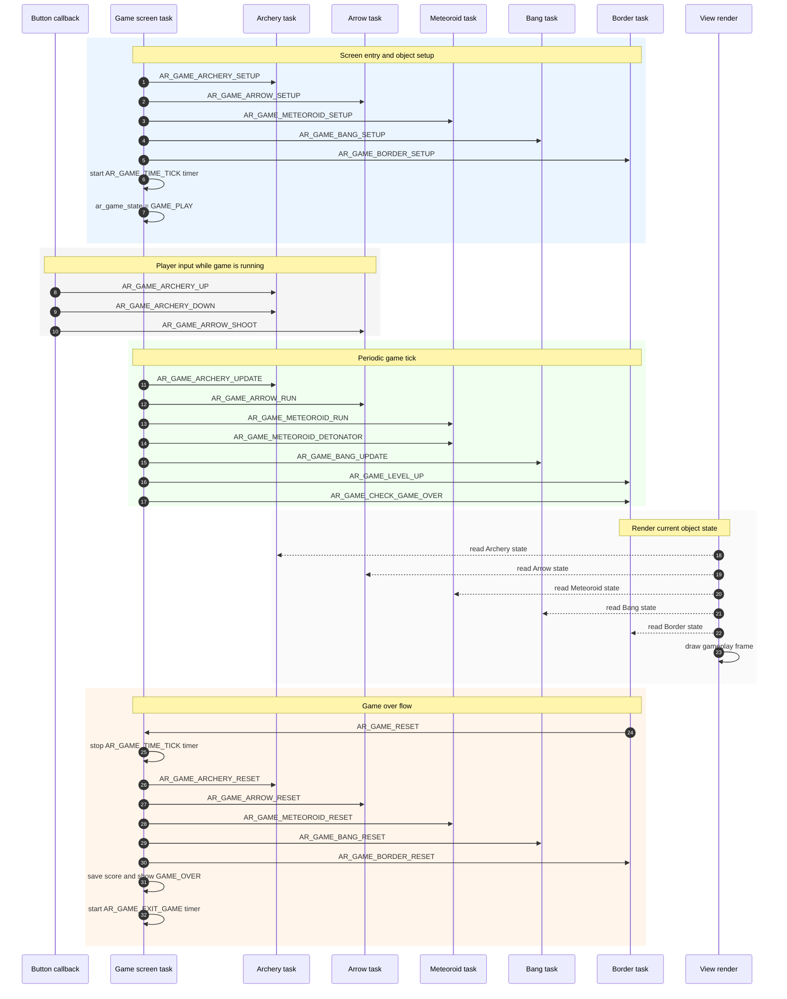
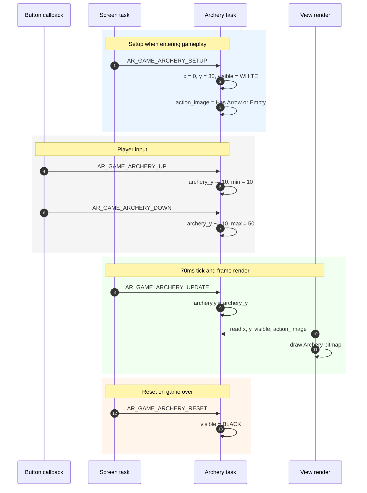
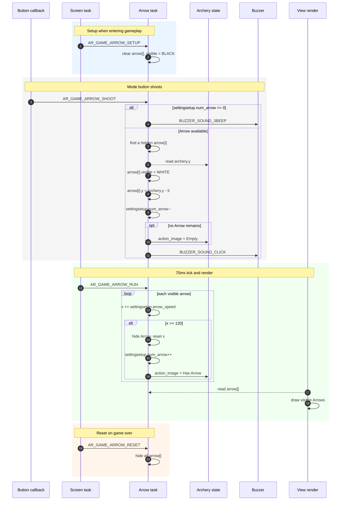
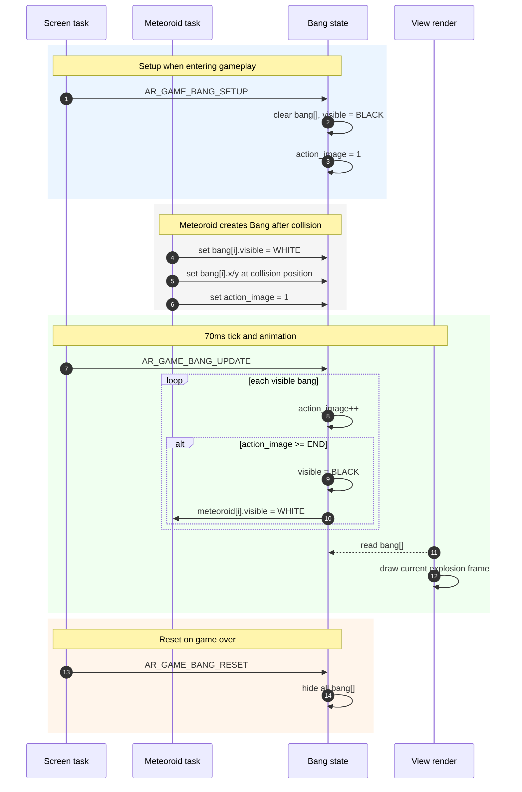
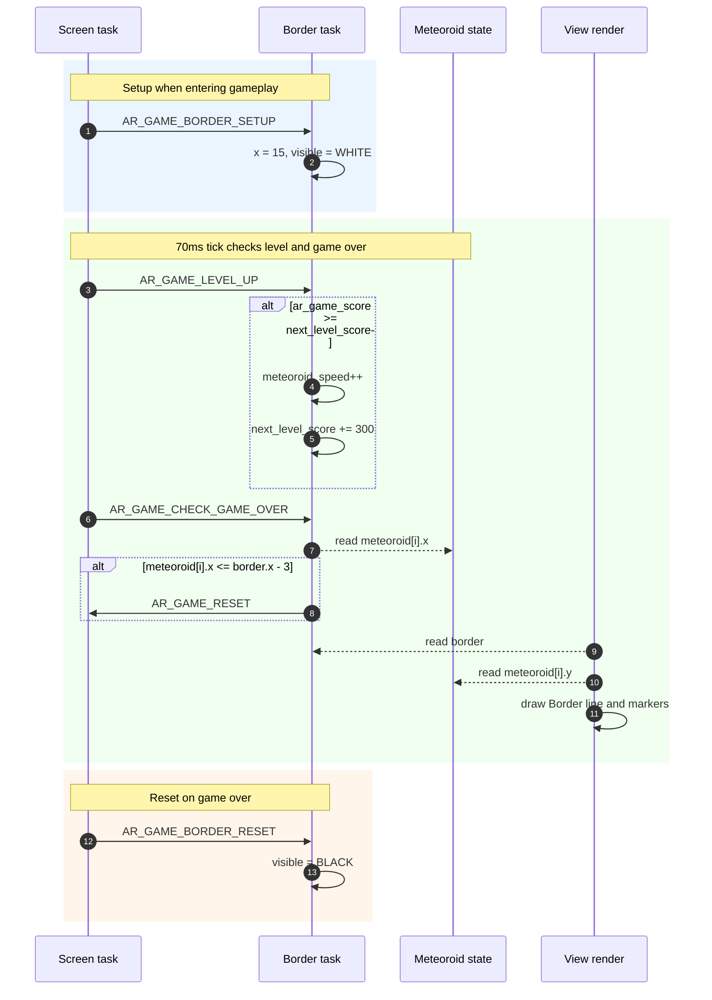
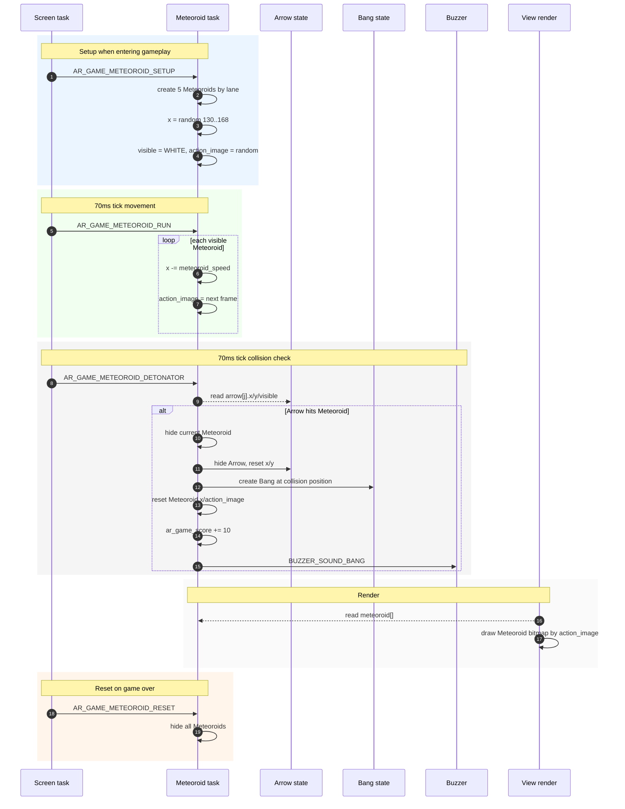
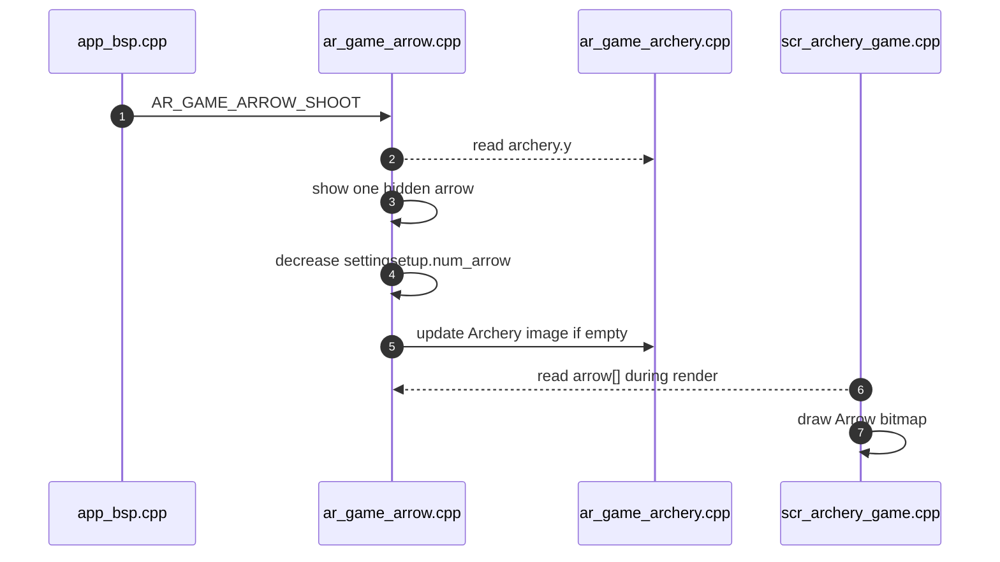

# Archery Game - Build on AK Embedded Base Kit

| [VN](README.md) | [EN] |

## I. Introduction

The Archery game is a game running on the AK Embedded Base Kit. It is built to help embedded programming enthusiasts learn and practice event-driven programming. During the development of the archery game, you will learn more about designing and applying UML, Tasks, Signals, Timers, Messages, State-machines,...

### 1.1 Hardware

<p align="center"></p>
<p align="center"><strong><em>Figure 1:</em></strong> AK Embedded Base Kit - STM32L151</p>

[AK Embedded Base Kit](https://epcb.vn/products/ak-embedded-base-kit-lap-trinh-nhung-vi-dieu-khien-mcu) is an evaluation kit for advanced embedded software learners.

The KIT integrates an **OLED 1.3" LCD, 3 buttons, and a Buzzer speaker**, with these features sufficient to learn the event-driven system through practical game design.

The KIT also integrates **RS485, NRF24L01+, and Flash up to 32MB**, suitable for prototyping real-world applications in embedded systems such as wired, wireless communication, data logger storage applications,...

### 1.2 Game Description and Objects
The following description of the **“Archery game”**, explains how to play and the game's processing mechanism. This document is used for reference in designing and developing the game later.

<p align="center"></p>
<p align="center"><strong><em>Figure 2:</em></strong> Menu game</p>

The game starts with the **Menu game** screen with the following options: 
- **Archery Game:** Select to start the game.
- **Setting:** Select to set the game parameters.
- **Charts:** Select to view the top 3 highest scores.
- **Exit:** Exit the menu to the standby screen.

<p align="center"></p>
<p align="center"><strong><em>Figure 3:</em></strong> Game play screen and objects</p>

#### 1.2.1 Objects in the Game:
|Object|Object Name|Description|
|---|---|---|
|**Bow**|Archery|Move up/down to select the position to shoot the arrow|
|**Arrow**|Arrow|Shot from the bow, used to destroy meteoroids|
|**Explosion**|Bang|Effect that appears when meteoroid is destroyed|
|**Border**|Border|Safe zone to protect from meteoroids falling into|
|**Meteoroid**|Meteoroid|Object flying towards the bow with increasing speed, capable of destroying the border|

**(*)** In the rest of the document, the names of the objects will be used to refer to the objects.

#### 1.2.2 How to Play: 
- In this game, you will control the Archery, move **up/down** with the **[Up]/[Down]** buttons, to select the position to **shoot** the Arrow.
- When pressing the **[Mode]** button, the Arrow will be shot, aiming to destroy the incoming Meteoroids.
- The goal of the game is to get as many points as possible, the game will end when a Meteoroid touches the Border.

#### 1.2.3 Game Mechanics:
- **Scoring:** Points are calculated by the number of Meteoroids destroyed. Each destroyed Meteoroid corresponds to 10 points. The accumulated score will be displayed in the bottom right corner of the screen.
- **Difficulty:** Every time 200 points are accumulated, the Meteoroid's flying speed will increase by one level. The initial difficulty can be set in the **Setting** section.
- **Arrow Limit:** When shooting, the number of available Arrows will decrease corresponding to the number of flying Arrows, if the available Arrows decrease to "0", you cannot shoot and there will be a warning sound. The number of available Arrows will be restored when a Meteoroid is destroyed or the Arrow flies off the screen. The number of Arrows is displayed in the bottom left corner of the screen and can be changed in the **Setting**.

- **Animation:** To make the game more lively, objects will have additional animation when moving.
- **Game Over:** When a Meteoroid touches the Border, the game will end. Objects will be reset and the score will be saved. You will enter the “Game Over” screen with 3 options:
  - **Restart:** play again.
  - **Charts:** go to view the leaderboard.
  - **Home:** back to the game menu.

<p align="center"></p>
<p align="center"><strong><em>Figure 4:</em></strong> Game_over screen</p>

## II. Design - ARCHERY GAME

Archery Game is designed around the **event-driven** model from the AK framework:

- **Task** is the unit that receives and handles messages.
- **Signal** is the event or command that tells a task what to do.
- **Message** is the object queued for a task; most game messages are pure messages that only carry a signal.
- **Handler** is the function that processes messages for a task, such as `ar_game_arrow_handle()` or `scr_archery_game_handle()`.

### 2.1 Sequence Diagram

The diagram below summarizes the gameplay flow, based on `scr_archery_game.cpp`, `app_bsp.cpp`, and the objects in `application/sources/app/game/archery_game`.



Key points:
- `SCREEN_ENTRY`: reads settings from EEPROM, sets up every object, and creates the `AR_GAME_TIME_TICK` timer.
- `AR_GAME_TIME_TICK`: the current gameplay tick is `70ms`, used to update objects and check game over.
- Button callbacks in `app_bsp.cpp` send gameplay signals directly when `ar_game_state != GAME_OFF`.
- When Border detects a Meteoroid crossing the boundary, it sends `AR_GAME_RESET` to `AR_GAME_SCREEN_ID`.
- After reset, Screen saves the score, shows `GAME_OVER`, then uses `AR_GAME_EXIT_GAME` to switch to the Game Over screen.

### 2.2 Details

The main design pieces are object state, processing tasks, signals exchanged between tasks, and EEPROM-backed setting/score data.

#### 2.2.1 Object Attributes

Game objects share a small set of attributes for rendering and animation:

|Attribute|Meaning|
|---|---|
|`visible`|Whether the object should be drawn on the screen.|
|`x`, `y`|Current object position on the 128x64 OLED.|
|`action_image`|Current image frame, used for animation or display state.|

Current source mapping:

|Object|Struct|Main variable|Count|Note|
|---|---|---|---|---|
|Archery|`ar_game_archery_t`|`archery`|1|2 frames: has-arrow and empty.|
|Arrow|`ar_game_arrow_t`|`arrow[MAX_NUM_ARROW]`|Up to 9|Maximum count comes from `AR_GAME_SETTING_NUM_ARROW_MAX`.|
|Bang|`ar_game_bang_t`|`bang[NUM_BANG]`|5|3-frame explosion effect.|
|Border|`ar_game_border_t`|`border`|1|Safe boundary at `x = 15`.|
|Meteoroid|`ar_game_meteoroid_t`|`meteoroid[NUM_METEOROIDS]`|5|One Meteoroid per lane.|

Important state and configuration variables:

|Variable|Type|Role|
|---|---|---|
|`ar_game_state`|`uint8_t`|Game state: `GAME_OFF`, `GAME_PLAY`, `GAME_OVER`.|
|`ar_game_score`|`uint32_t`|Current score in the active run.|
|`settingsetup`|`ar_game_setting_t`|Settings used by the active run.|
|`gamescore`|`ar_game_score_t`|Score table read from and written to EEPROM.|

`ar_game_setting_t` contains `silent`, `num_arrow`, `arrow_speed`, and `meteoroid_speed`. `ar_game_score_t` stores `score_now`, `score_1st`, `score_2nd`, and `score_3rd`.

#### 2.2.2 Task

Archery Game tasks are registered in `application/sources/app/task_list.cpp`, all using `TASK_PRI_LEVEL_4`.

|Task ID|Handler|Role|
|---|---|---|
|`AR_GAME_SCREEN_ID`|`scr_archery_game_handle`|Coordinates game lifecycle: setup, tick, reset, game over, and screen transition.|
|`AR_GAME_ARCHERY_ID`|`ar_game_archery_handle`|Manages Archery position and display state.|
|`AR_GAME_ARROW_ID`|`ar_game_arrow_handle`|Shoots Arrow, updates Arrow position, restores Arrow count when it leaves the screen.|
|`AR_GAME_METEOROID_ID`|`ar_game_meteoroid_handle`|Creates Meteoroids, moves them, animates them, and checks Arrow collision.|
|`AR_GAME_BANG_ID`|`ar_game_bang_handle`|Updates explosion animation and shows the related Meteoroid again.|
|`AR_GAME_BORDER_ID`|`ar_game_border_handle`|Increases level by score and checks the game-over condition.|

Outside the game task group, `AC_TASK_DISPLAY_ID` still owns the general screen flow. Outside gameplay, button callbacks send signals to `AC_TASK_DISPLAY_ID`; during gameplay, they send directly to `AR_GAME_ARCHERY_ID` or `AR_GAME_ARROW_ID`.

#### 2.2.3 Message & Signal

The main signals are defined in `application/sources/app/app.h`.

|Group|Signal|Meaning|
|---|---|---|
|Screen|`AR_GAME_TIME_TICK`|Periodic timer tick used to update all objects.|
|Screen|`AR_GAME_RESET`|Resets the game when Border detects a losing condition.|
|Screen|`AR_GAME_OVER_TEXT_ANIM_TICK`|Timer for the animated text during game over.|
|Screen|`AR_GAME_EXIT_GAME`|One-shot timer used to switch to the Game Over screen.|
|Archery|`AR_GAME_ARCHERY_SETUP`|Initializes Archery position and state.|
|Archery|`AR_GAME_ARCHERY_UPDATE`|Copies the internal control position to the render position.|
|Archery|`AR_GAME_ARCHERY_UP`|Moves Archery up.|
|Archery|`AR_GAME_ARCHERY_DOWN`|Moves Archery down.|
|Archery|`AR_GAME_ARCHERY_RESET`|Hides Archery when leaving gameplay.|
|Arrow|`AR_GAME_ARROW_SETUP`|Clears all Arrows.|
|Arrow|`AR_GAME_ARROW_RUN`|Updates flying Arrow positions.|
|Arrow|`AR_GAME_ARROW_SHOOT`|Shoots an Arrow from the current Archery position.|
|Arrow|`AR_GAME_ARROW_RESET`|Hides all Arrows.|
|Meteoroid|`AR_GAME_METEOROID_SETUP`|Creates initial Meteoroids by lane.|
|Meteoroid|`AR_GAME_METEOROID_RUN`|Moves Meteoroids and advances animation frames.|
|Meteoroid|`AR_GAME_METEOROID_DETONATOR`|Checks Arrow-Meteoroid collision.|
|Meteoroid|`AR_GAME_METEOROID_RESET`|Hides all Meteoroids.|
|Bang|`AR_GAME_BANG_SETUP`|Clears all Bang effects.|
|Bang|`AR_GAME_BANG_UPDATE`|Updates explosion frames.|
|Bang|`AR_GAME_BANG_RESET`|Hides all Bang effects.|
|Border|`AR_GAME_BORDER_SETUP`|Initializes Border.|
|Border|`AR_GAME_LEVEL_UP`|Increases Meteoroid speed when score reaches a threshold.|
|Border|`AR_GAME_CHECK_GAME_OVER`|Checks whether a Meteoroid touches Border.|
|Border|`AR_GAME_BORDER_RESET`|Hides Border.|

## III. Detailed Code Guide for Objects

The game objects follow an event-driven structure. `scr_archery_game.cpp` sends the main signals when the game starts, on every 70ms tick, and when the game resets. Files under `application/sources/app/game/archery_game` focus on the state of each object.

### 3.1 Archery

Archery is the object controlled by the **[Up]** and **[Down]** buttons. Main source: `ar_game_archery.cpp`.



Summary:
- `archery_y` is the internal control position; each tick copies it into `archery.y` for rendering.
- Archery has 2 visual states: has Arrow and empty.
- Buttons do not draw directly; they only send signals to the Archery task.

### 3.2 Arrow

Arrow manages the list of flying arrows. Main source: `ar_game_arrow.cpp`.



Summary:
- Arrow shoots only when `settingsetup.num_arrow` is greater than zero.
- Each Arrow moves on the X axis, using the speed from setting.
- When an Arrow leaves the screen or destroys a Meteoroid, the available Arrow count is restored.

### 3.3 Bang

Bang is the explosion effect after an Arrow destroys a Meteoroid. Main source: `ar_game_bang.cpp`; Bang is activated from `ar_game_meteoroid.cpp` when a collision is detected.



Summary:
- Bang does not detect collisions by itself; Meteoroid creates Bang after a collision.
- The animation has 3 frames, then Bang hides itself.
- When Bang finishes, the related Meteoroid becomes visible again.

### 3.4 Border

Border is the safe boundary on the left side of the screen. Main source: `ar_game_border.cpp`.



Summary:
- Border does not move; it only checks the losing condition.
- Every 300 points, Meteoroid speed increases if it has not reached the setting limit.
- When a Meteoroid reaches `border.x - 3`, Border sends `AR_GAME_RESET` back to Screen.

### 3.5 Meteoroid

Meteoroid is the group of objects flying from right to left. Main source: `ar_game_meteoroid.cpp`.



Summary:
- There are 5 Meteoroids, one per lane, spaced 10px apart on the Y axis.
- The initial X position and post-hit X position are randomized outside the right edge of the screen.
- Meteoroid handles both movement and collision checking with Arrow.

## IV. Display and Sound in Archery Game

### 4.1 Graphics

The game is displayed on a **1.3" OLED screen with a 128x64 px resolution**, so every in-game object is designed as a small fixed-size monochrome bitmap. The bitmaps are declared in `application/sources/app/screens/screens_bitmap.cpp` and exposed through `screens_bitmap.h`.

#### 4.1.1 Designing Graphics for Objects

<p align="center"></p>
<p align="center"><strong><em>Figure 13:</em></strong> Object bitmaps</p>

Main bitmaps used by the gameplay screen:

|Object|Bitmap|Size|Note|
|---|---|---|---|
|Archery|`bitmap_archery_I`, `bitmap_archery_II`|15x15 px|Selected by `archery.action_image`, representing the has-arrow / empty states.|
|Arrow|`bitmap_arrow`|10x5 px|Rendered for each visible `arrow[i]`.|
|Meteoroid|`bitmap_meteoroid_I`, `bitmap_meteoroid_II`, `bitmap_meteoroid_III`|20x10 px|Animated by updating `meteoroid[i].action_image` on each tick.|
|Bang|`bitmap_bang_I`, `bitmap_bang_II`, `bitmap_bang_III`|15x15 px, 10x10 px|Explosion effect shown after an Arrow hits a Meteoroid.|
|Border|-|Vertical line 0..54 px|Drawn with `drawFastVLine()` and small dots aligned with Meteoroid positions.|
|Game over|`bitmap_dolphin`|119x62 px|Game-over background with animated result text such as `Excellent`, `Too Bad!`, ...|

Each object has common attributes such as `visible`, `x`, `y`, and `action_image`. When `visible == WHITE`, its display function draws the object with `view_render.drawBitmap()` or an OLED primitive.

#### 4.1.2 Display Flow

The gameplay screen is rendered by `view_scr_archery_game()` in `scr_archery_game.cpp`. While the game is running (`GAME_PLAY`), the screen is composed from these layers:

- `ar_game_frame_display()`: draws the frame, remaining Arrow count, and Score.
- `ar_game_archery_display()`: draws the bow.
- `ar_game_arrow_display()`: draws flying arrows.
- `ar_game_meteoroid_display()`: draws meteoroids.
- `ar_game_bang_display()`: draws explosion effects.
- `ar_game_border_display()`: draws the safe border.

When the game switches to `GAME_OVER`, the screen clears the old gameplay view, draws `bitmap_dolphin`, then gradually prints the result text using the `AR_GAME_OVER_TEXT_ANIM_TICK` timer.

```cpp
if (ar_game_state == GAME_PLAY) {
    ar_game_frame_display();
    ar_game_archery_display();
    ar_game_arrow_display();
    ar_game_meteoroid_display();
    ar_game_bang_display();
    ar_game_border_display();
}
```

### 4.2 Sound

Sound is managed through the buzzer driver. At the application level, the code no longer calls long tone arrays directly; it plays sound by ID:

```cpp
BUZZER_PlaySound(BUZZER_SOUND_CLICK);
BUZZER_Sleep(settingdata.silent);
```

Sound IDs are defined in `application/sources/driver/buzzer/buzzer_music.h`, mapped to tone arrays in `application/sources/driver/buzzer/buzzer.c`, and the tone data lives in `buzzer_music.c`. This keeps the screen/game code focused on the event that needs a sound.

Sounds currently used by the screens and gameplay:

|Event|Sound ID|Main call site|
|---|---|---|
|Button press, menu movement, item selection|`BUZZER_SOUND_CLICK`|`scr_menu_game.cpp`, `scr_game_setting.cpp`, `scr_game_over.cpp`, `scr_charts_game.cpp`|
|Arrow shot successfully|`BUZZER_SOUND_CLICK`|`ar_game_arrow.cpp`|
|No Arrow left to shoot|`BUZZER_SOUND_3BEEP`|`ar_game_arrow.cpp`|
|Arrow destroys a Meteoroid|`BUZZER_SOUND_BANG`|`ar_game_meteoroid.cpp`|
|Startup|`BUZZER_SOUND_STARTUP`|`scr_startup.cpp`, `scr_game_setting.cpp`|
|High-score game over|`BUZZER_SOUND_HIGHSCORE`|`scr_archery_game.cpp`|
|Low-score game over|`BUZZER_SOUND_LOWSCORE`|`scr_archery_game.cpp`|
|Enable/disable sound from setting|`BUZZER_Sleep(settingdata.silent)`|`scr_startup.cpp`, `scr_game_setting.cpp`|

## V. EEPROM Management

EEPROM is used to store data that must be retained after power-off, including the score table and game configuration. Because EEPROM may contain invalid data, each data block written to EEPROM is wrapped with a `Magic number` and a `checksum` to ensure data integrity.

### 5.1 Management Structure

Each record stored in EEPROM has the following format:

```text
+----------------------+----------------------+----------------------+
| Magic number         | Data                 | Checksum             |
| 4 bytes              |                      | 1 byte               |
+----------------------+----------------------+----------------------+
```

Where:
- `Magic number`: Each application should have its own Magic number.
- `Data`: The data that needs to be stored.
- `Checksum`: The sum of all bytes from the `Magic number` through the end of the `data`, used to check whether the data has been changed.

### 5.2 Purpose

Using a `Magic number` together with a `Checksum` helps ensure the validity and integrity of EEPROM data:
- **Detect corrupted or unintentionally modified data:** `Checksum` allows the firmware to verify data integrity and avoid using damaged data.
- **Detect matching data:** each application should use its own `Magic number`, which helps avoid reading data that belongs to another firmware.

**Code:**
```cpp
extern bool ar_game_score_read(ar_game_score_t* data);
extern bool ar_game_score_write(ar_game_score_t* data);

extern bool ar_game_setting_read(ar_game_setting_t* data);
extern bool ar_game_setting_write(ar_game_setting_t* data);
```

## VI. Source Reading and Extension Guide

This section is for interns who are new to the codebase. When reading the code, follow the flow **screen -> signal -> task handler -> object state -> render** instead of reading files in isolation.

### 6.1 Source Map

|Area|File/folder|Read it when you need to|
|---|---|---|
|App startup|`application/sources/app/app.cpp`|See how tasks, timers, buttons, display, and the entry screen are initialized.|
|Task list|`application/sources/app/task_list.cpp`|Map each task ID to its handler.|
|Signals/timers|`application/sources/app/app.h`|Look up signal names, timer intervals, and signal groups by task.|
|Button input|`application/sources/app/app_bsp.cpp`|See which signal Mode/Up/Down sends during gameplay or menu screens.|
|Screen manager|`application/sources/common/screen_manager.cpp`|Understand `SCREEN_CTOR`, `SCREEN_TRAN`, `SCREEN_ENTRY`, and render interval behavior.|
|OLED render|`application/sources/common/view_render.cpp`|Understand how a view is cleared, rendered item by item, and updated to the screen.|
|Gameplay screen|`application/sources/app/screens/scr_archery_game.cpp`|Follow game setup, tick, reset, score saving, and game-over text.|
|Object logic|`application/sources/app/game/archery_game/*.cpp`|Read the logic for Archery, Arrow, Bang, Border, and Meteoroid.|
|Bitmap/icon|`application/sources/app/screens/screens_bitmap.cpp`|Find bitmap data for objects and icons.|
|EEPROM|`application/sources/app/app_eeprom.cpp`|Read/write settings and scores with magic number + checksum.|
|Buzzer|`application/sources/driver/buzzer`|Find sound IDs, tone data, and `BUZZER_PlaySound()`.|

### 6.2 How to Trace a Signal

Example: trace the **[Mode]** button when shooting an Arrow:



General tracing steps:

1. Find the signal in `app.h`.
2. Find where it is posted with `rg "SIGNAL_NAME" application/sources/app`.
3. Find the receiving task in `task_list.cpp`.
4. Read `case SIGNAL_NAME` in the corresponding handler.
5. Check which state variables the handler changes.
6. Find the display function that reads those variables in `scr_archery_game.cpp`.

### 6.3 Workflow for Changing or Adding an Object

When adding a new gameplay object, use this checklist:

|Step|Task|Common files|
|---|---|---|
|1|Define struct, count, bitmap size, and `action_image` enum.|`game/archery_game/ar_game_xxx.h`|
|2|Write the handler for `SETUP`, `UPDATE/RUN`, and `RESET`.|`game/archery_game/ar_game_xxx.cpp`|
|3|Add task ID and signals.|`task_list.h`, `app.h`|
|4|Register the task in the task table.|`task_list.cpp`|
|5|Post setup/tick/reset signals from the screen.|`screens/scr_archery_game.cpp`|
|6|Add the display function and call it from `view_scr_archery_game()`.|`screens/scr_archery_game.cpp`|
|7|Add bitmap data if the object needs new graphics.|`screens/screens_bitmap.cpp`, `screens_bitmap.h`|
|8|Check collision or interaction with other objects if needed.|`ar_game_meteoroid.cpp`, `ar_game_arrow.cpp`, or related handlers.|

### 6.4 Workflow for Settings, Score, and Sound

- To add a new setting: add a field to `ar_game_setting_t`, update defaults in `app_eeprom.cpp`, update `scr_game_setting.cpp`, then verify EEPROM checksum handling.
- To change scoring: start at `ar_game_meteoroid.cpp` where `ar_game_score += 10`, then check `ar_game_border.cpp` because level progression depends on score.
- To change the leaderboard: read `rank_ranking()` in `scr_archery_game.cpp` and the chart screen in `scr_charts_game.cpp`.
- To add sound: add a sound ID in `buzzer_music.h`, add tone data in `buzzer_music.c`, map the sound to tones in `buzzer.c`, then call `BUZZER_PlaySound()`.

### 6.5 Pre-Submission Checklist

- The project builds without errors.
- Gameplay can still be opened from the menu.
- **Up/Down/Mode** still work correctly in gameplay and menu screens.
- Game over still saves the score and transitions to the Game Over screen.
- EEPROM settings still fall back to defaults when EEPROM data is invalid.
- Mermaid diagrams in README still render on GitHub or in VS Code with Mermaid preview.
