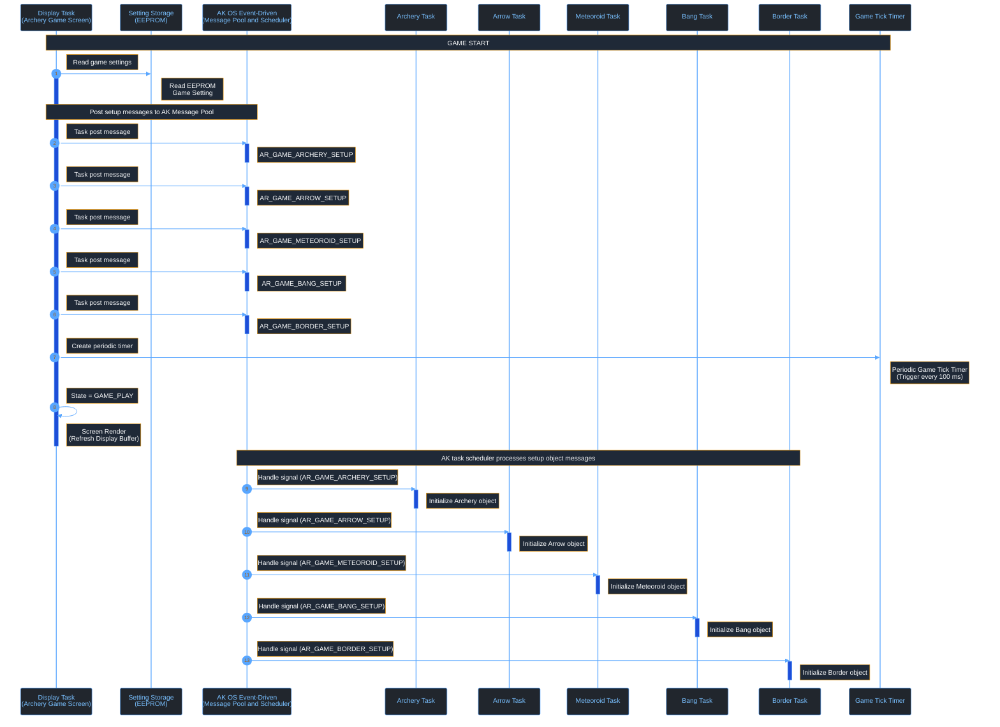
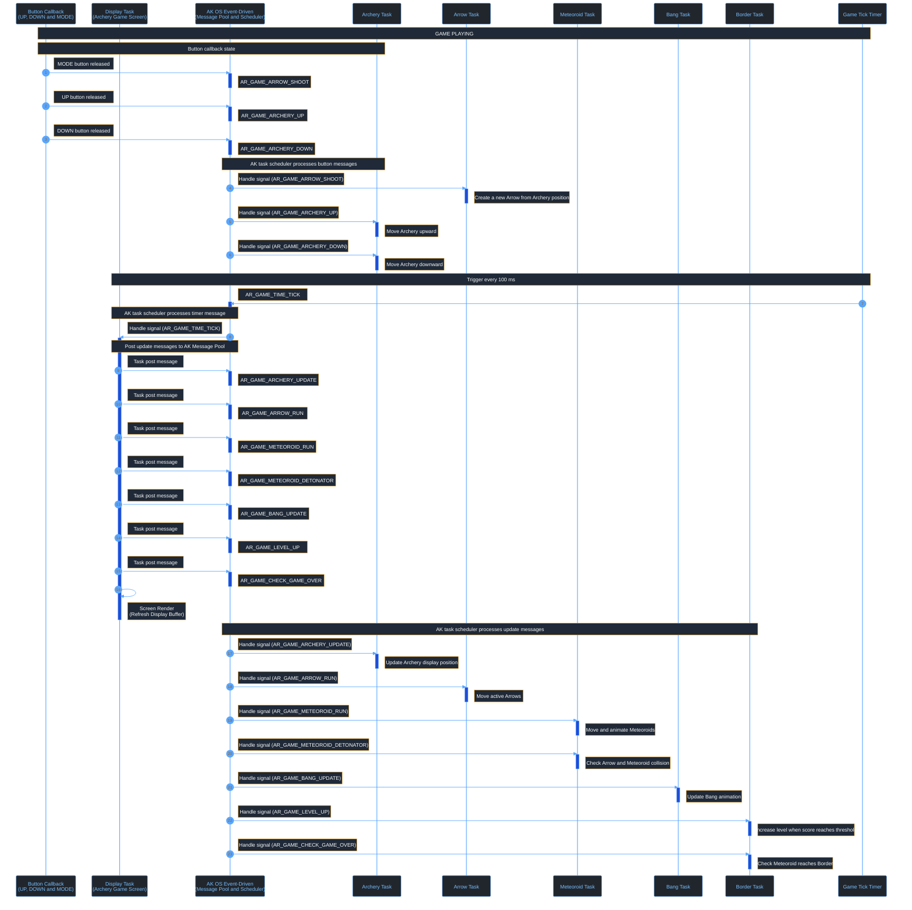
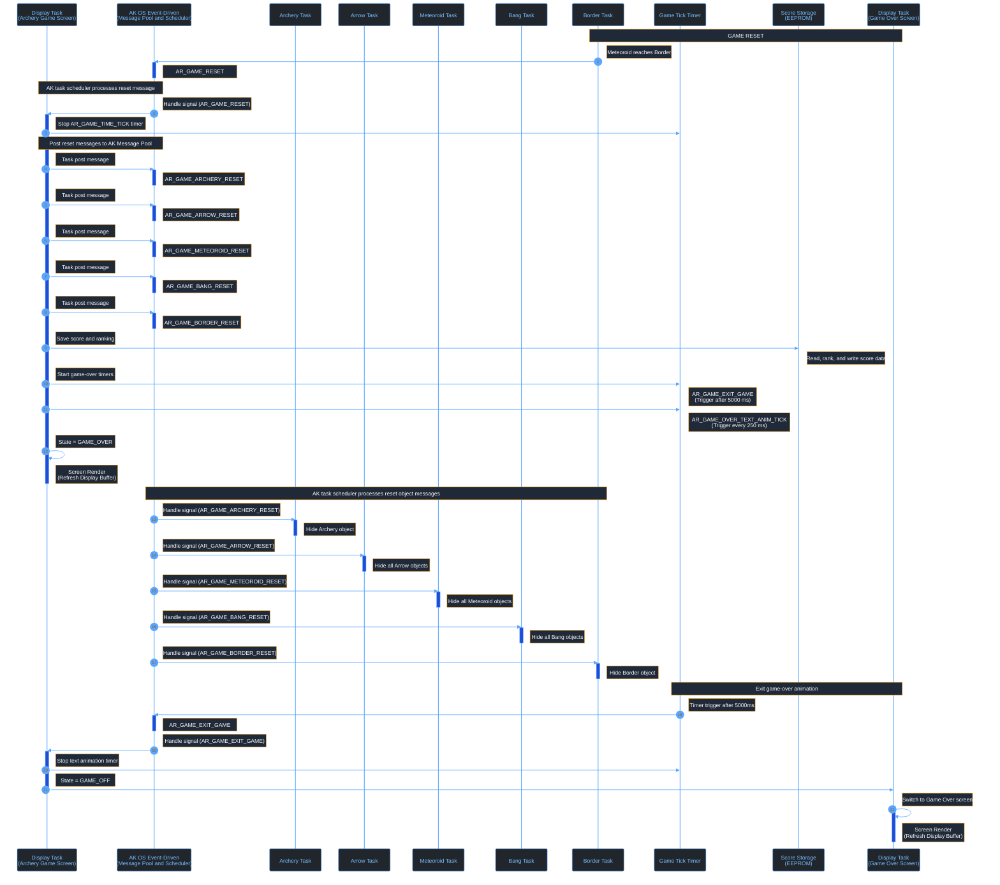

# Archery Game Signal Processing

This document explains how the Archery Game processes button input, task messages, game-loop ticks, and object updates. The game uses the AK event-driven task architecture: each major game object owns a task, receives signals through AK messages, and updates its own state.

## I. Overview

The Archery Game is implemented using event-driven tasks.

Each game object owns:

- A dedicated task
- Its own signal handler
- Its own state data
- Its own update logic

The display task (`AC_TASK_DISPLAY_ID`) owns the screen manager and handles screen-level events. During gameplay, it also receives the periodic game tick and posts update messages for each game-object task.

Input events from hardware buttons are converted into software signals. These signals are posted into the AK message pool first, then the AK scheduler dispatches them to the destination task handler.

The main game loop is driven by a periodic timer signal:

```c
AR_GAME_TIME_TICK
```

The current game tick interval is:

```c
AR_GAME_TIME_TICK_INTERVAL = 100 ms
```

Main runtime flow:

1. Button callbacks or timers create software signals.
2. Signals are posted into the AK message pool.
3. The AK scheduler dispatches messages to destination task handlers.
4. Each task updates only the state it owns.
5. The screen render reads the latest object state and refreshes the display buffer.

### High Level Architecture

#### 1. Game Start



#### 2. Game Playing



#### 3. Game Reset




## II. Code References

| Area | File |
|---|---|
| Task IDs and task handlers | `application/sources/app/task_list.h` |
| Task table registration | `application/sources/app/task_list.cpp` |
| Signal definitions | `application/sources/app/app.h` |
| Button callback logic | `application/sources/app/app_bsp.cpp` |
| Main game screen logic | `application/sources/app/screens/scr_archery_game.cpp` |
| Screen manager | `application/sources/common/screen_manager.cpp` |

## III. Task Ownership

| Task | Responsibility | Owns Data | Receives Signals |
|---|---|---|---|
| `AC_TASK_DISPLAY_ID` | Screen manager, render scheduling, and central game tick dispatch | Current screen state | Display signals and game tick signals |
| `AR_GAME_ARCHERY_ID` | Archer/player control | Archer position and display state | `SETUP`, `UPDATE`, `UP`, `DOWN`, `RESET` |
| `AR_GAME_ARROW_ID` | Arrow movement and shooting | Arrow state and active arrows | `SETUP`, `RUN`, `SHOOT`, `RESET` |
| `AR_GAME_METEOROID_ID` | Meteoroid movement and collision checks | Meteoroid state | `SETUP`, `RUN`, `DETONATOR`, `RESET` |
| `AR_GAME_BANG_ID` | Explosion animation | Effect frames and visibility | `SETUP`, `UPDATE`, `RESET` |
| `AR_GAME_BORDER_ID` | Border logic and game-over detection | Border state and level/game-over checks | `SETUP`, `LEVEL_UP`, `CHECK_GAME_OVER`, `RESET` |

## IV. Button Event Processing

Button callbacks serve two screen modes:

- Normal screen mode (`ar_game_state == GAME_OFF`): button signals are posted to `AC_TASK_DISPLAY_ID` for menu or screen navigation.
- Gameplay screen mode (`ar_game_state != GAME_OFF`): button signals are posted directly to game-object tasks, such as Arrow for shooting and Archery for movement.

In both modes, the callback only posts a signal to AK. The destination task handles that signal later when the AK scheduler dispatches it.

### Button Processing Rules

| Button | Condition | Posted Signal | Destination |
|---|---|---|---|
| MODE Released | `ar_game_state == GAME_OFF` | `AC_DISPLAY_BUTTON_MODE_RELEASED` | `AC_TASK_DISPLAY_ID` |
| MODE Released | `ar_game_state != GAME_OFF` | `AR_GAME_ARROW_SHOOT` | `AR_GAME_ARROW_ID` |
| UP Released | `ar_game_state == GAME_OFF` | `AC_DISPLAY_BUTTON_UP_RELEASED` | `AC_TASK_DISPLAY_ID` |
| UP Released | `ar_game_state != GAME_OFF` | `AR_GAME_ARCHERY_UP` | `AR_GAME_ARCHERY_ID` |
| DOWN Released | `ar_game_state == GAME_OFF` | `AC_DISPLAY_BUTTON_DOWN_RELEASED` | `AC_TASK_DISPLAY_ID` |
| DOWN Released | `ar_game_state != GAME_OFF` | `AR_GAME_ARCHERY_DOWN` | `AR_GAME_ARCHERY_ID` |

## V. Runtime Scheduling Notes

The system uses asynchronous task-based scheduling.

Important runtime characteristics:

- Signals are queued in AK before they are handled.
- A sender posts a message; it does not directly execute the destination task handler.
- Handlers are isolated by task ownership.
- Game logic is decoupled through signals.
- Timing depends on scheduler execution order.
- A signal may wait in the AK message pool before its handler executes.
- `AR_GAME_TIME_TICK` can appear between button pressed and released logs because the timer keeps running.
