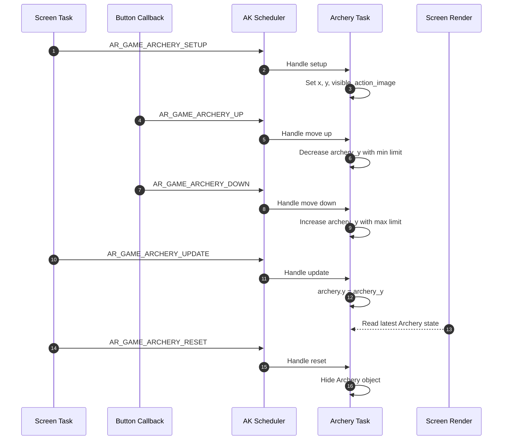
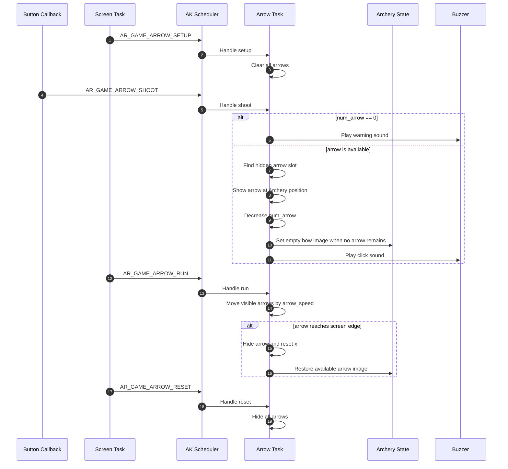
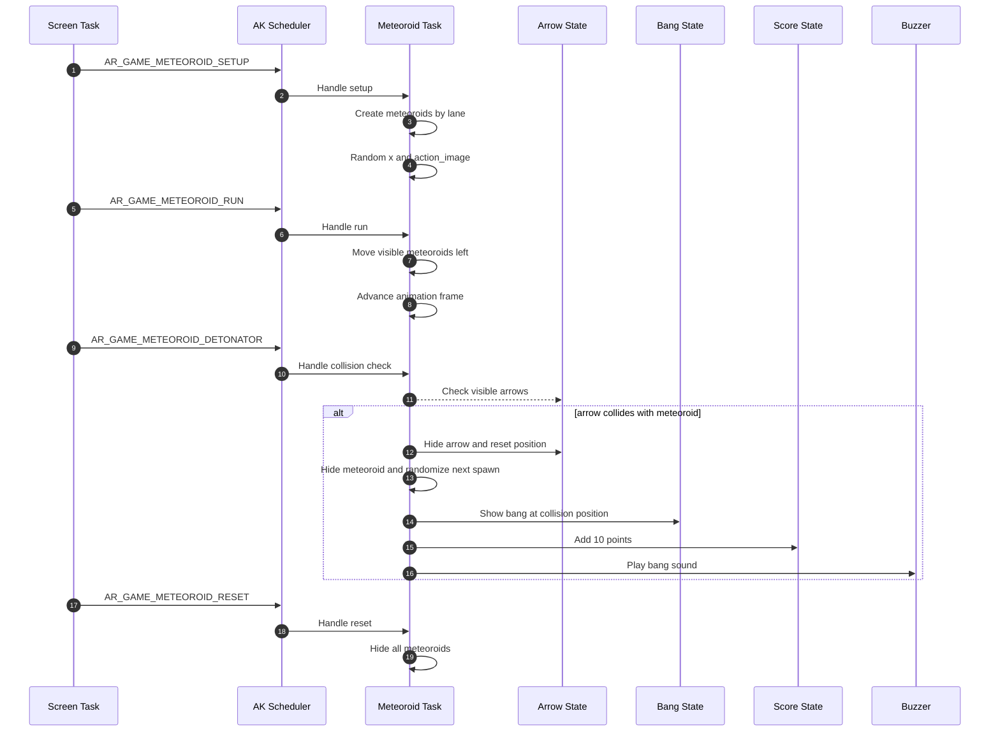
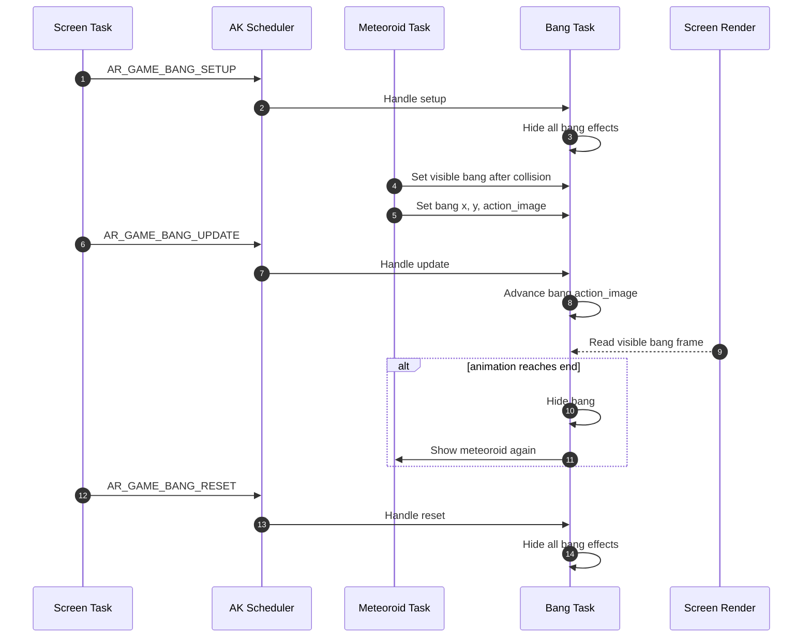
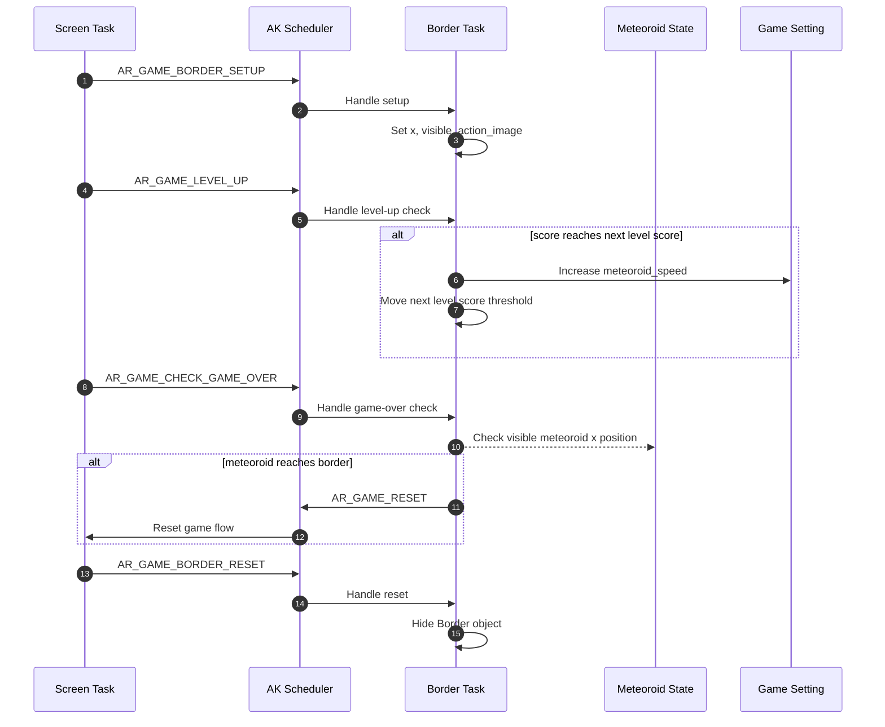

# Object Sequence

This document describes the runtime sequence of each main object in Archery Game. Each object is handled by its own AK task and receives signals from the screen task, button callbacks, timers, or other object tasks.

## I. Object Summary

| Object | Task ID | Handler | Main responsibility |
|---|---|---|---|
| Archery | `AR_GAME_ARCHERY_ID` | `ar_game_archery_handle()` | Controls the player position and bow image state. |
| Arrow | `AR_GAME_ARROW_ID` | `ar_game_arrow_handle()` | Shoots arrows, moves active arrows, and restores available arrow count. |
| Meteoroid | `AR_GAME_METEOROID_ID` | `ar_game_meteoroid_handle()` | Spawns meteoroids, moves them, checks collision with arrows, and updates score. |
| Bang | `AR_GAME_BANG_ID` | `ar_game_bang_handle()` | Plays explosion animation after a meteoroid is hit. |
| Border | `AR_GAME_BORDER_ID` | `ar_game_border_handle()` | Checks level-up condition and game-over condition. |

## II. Archery Object Sequence

Archery owns the player position. Button signals update the internal `archery_y` value, and the periodic update signal copies it into the rendered `archery.y`.

## III. Arrow Object Sequence

Arrow receives shoot input from the MODE button. Each game tick moves visible arrows to the right. When an arrow exits the screen, it is hidden and the available arrow count is restored.

## IV. Meteoroid Object Sequence

Meteoroid moves from right to left. On each tick, it updates position and animation frame. Collision checking compares active arrows with visible meteoroids.

## V. Bang Object Sequence

Bang is the explosion effect. It becomes visible when Meteoroid detects a collision. The Bang task only advances the effect frame and restores the meteoroid after the animation ends.

## VI. Border Object Sequence

Border protects the safe area. It checks level-up by score and sends `AR_GAME_RESET` to the screen task when a visible meteoroid reaches the border.

## VII. Code References

| Object | Source file | Header file |
|---|---|---|
| Archery | `application/sources/app/game/archery_game/ar_game_archery.cpp` | `application/sources/app/game/archery_game/ar_game_archery.h` |
| Arrow | `application/sources/app/game/archery_game/ar_game_arrow.cpp` | `application/sources/app/game/archery_game/ar_game_arrow.h` |
| Meteoroid | `application/sources/app/game/archery_game/ar_game_meteoroid.cpp` | `application/sources/app/game/archery_game/ar_game_meteoroid.h` |
| Bang | `application/sources/app/game/archery_game/ar_game_bang.cpp` | `application/sources/app/game/archery_game/ar_game_bang.h` |
| Border | `application/sources/app/game/archery_game/ar_game_border.cpp` | `application/sources/app/game/archery_game/ar_game_border.h` |

