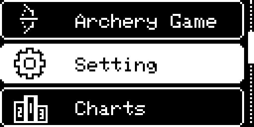
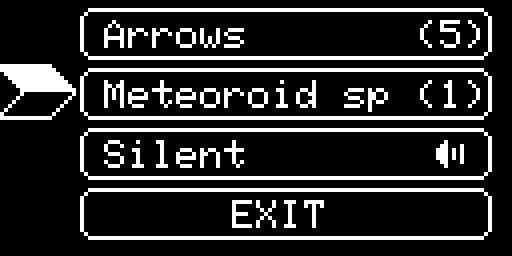

# Screen Image Zoom Test

This README is only for checking whether screen images stay clear or break when viewed and zoomed from a Markdown file.

## Sharp 4x Markdown Images

The displayed images below are pre-scaled `4x` versions. They are generated from the `128x64` OLED screenshots using nearest-neighbor scaling, so Markdown viewers do not need to resize the tiny originals.

### Idle Screen

### Menu Game

### Setting Screen

### Game Over

### Menu GIF

## Enlarged HTML Image Test

### Idle Screen Enlarged

### Menu Game Enlarged

### Setting Screen Enlarged

### Game Over Enlarged

## CSS Pixel Rendering Test

Some Markdown viewers ignore inline image-rendering styles. This section is here only to test whether your viewer supports them.

## Raw File Links

- [scr_idle.png](scr_idle.png)
- [scr_idle_4x.png](scr_idle_4x.png)
- [scr_menu_game_1.png](scr_menu_game_1.png)
- [scr_menu_game_1_4x.png](scr_menu_game_1_4x.png)
- [scr_setting.png](scr_setting.png)
- [scr_setting_4x.png](scr_setting_4x.png)
- [game_over.png](game_over.png)
- [game_over_4x.png](game_over_4x.png)
- [gif_archery_game_menu.gif](gif_archery_game_menu.gif)
- [gif_archery_game_menu_4x.gif](gif_archery_game_menu_4x.gif)
